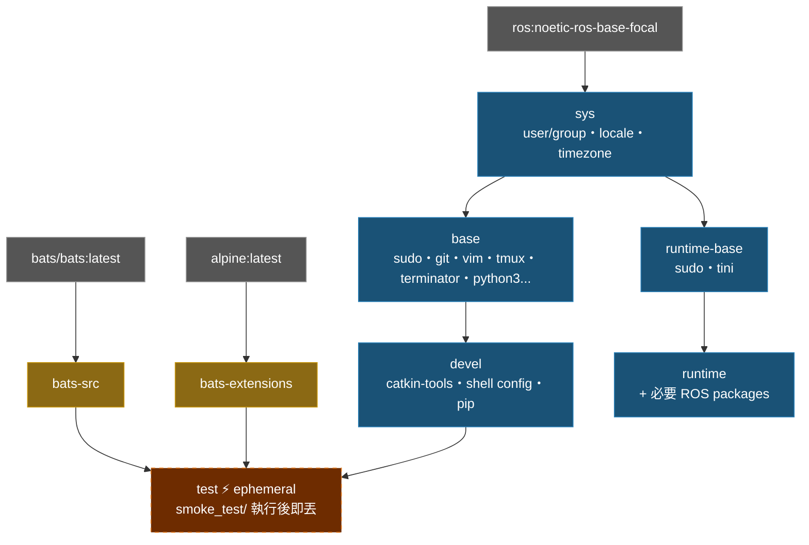

# ros_noetic 架構說明

## Docker Build Stage 關係圖



## Stage 說明

| Stage | FROM | 用途 |
|-------|------|------|
| `bats-src` | `bats/bats:latest` | bats 二進位來源，不出貨 |
| `bats-extensions` | `alpine:latest` | bats-support、bats-assert，不出貨 |
| `sys` | `ros:noetic-ros-base-focal` | OS 基礎：user/group、locale、timezone |
| `base` | `sys` | 通用開發工具（apt） |
| `devel` | `base` | 完整開發環境，含 shell 設定 |
| `test` | `devel` | 注入 bats，執行 smoke_test/，build 完即丟 |
| `runtime-base` | `sys` | 最小化 runtime 基底，無 dev tools |
| `runtime` | `runtime-base` | 加入應用所需 ROS packages |

## Build 指令

```bash
./build.sh            # 建置 devel（預設）
./build.sh test       # 執行 smoke test（失敗則 build 中斷）
./build.sh runtime    # 建置 runtime
```

## Smoke Test 涵蓋範圍

位於 `smoke_test/ros_env.bats`：

- ROS 環境：`ROS_DISTRO`、`setup.bash` 可 source、`rostopic`/`rosrun` 存在
- Dev tools：`catkin`、`python3`、`git` 可用
- 系統：非 root 用戶、timezone、locale、work 目錄可寫
