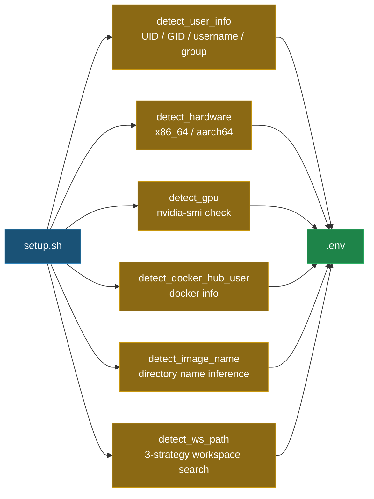
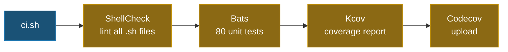

# Docker Setup Helper [](https://github.com/ycpss91255/docker_setup_helper/actions) [](https://codecov.io/gh/ycpss91255/docker_setup_helper)


[](./LICENSE)

[English] | [繁體中文](./README.zh-TW.md)

> **TL;DR** — Modular Bash toolkit that auto-detects system params (UID/GID, GPU, architecture, workspace) and generates `.env` for Docker Compose builds. 100% test coverage with Bats + Kcov.
>
> ```bash
> ./src/setup.sh        # Generate .env
> ./ci.sh               # Run tests locally
> ```

A modular Docker environment setup toolkit that automates system parameter detection and `.env` generation for Docker container builds. Designed to replace traditional `get_param.sh` scripts with a testable, extensible architecture.

## 🌟 Features

- **System Detection**: Auto-detects user info (UID/GID), hardware architecture, GPU support, and Docker Hub credentials.
- **Image Name Inference**: Derives image names from directory structure (`docker_*` prefix, `*_ws` suffix conventions).
- **Workspace Discovery**: 3-strategy workspace path detection (sibling scan, path traversal, parent directory fallback).
- **`.env` Generation**: Produces ready-to-use `.env` files for Docker Compose builds.
- **Shell Config Management**: Includes setup scripts for Bash, Tmux, and Terminator configurations.
- **100% Test Coverage**: All source code is fully tested with Bats + Kcov.

## 📁 Project Structure

```text
.
├── src/
│   ├── setup.sh                         # Main setup script (replaces get_param.sh)
│   └── config/
│       ├── pip/
│       │   ├── setup.sh                 # pip package installer
│       │   └── requirements.txt         # Python dependencies
│       └── shell/
│           ├── bashrc                   # Bash configuration
│           ├── terminator/
│           │   ├── setup.sh             # Terminator setup script
│           │   └── config               # Terminator configuration
│           └── tmux/
│               ├── setup.sh             # Tmux + TPM setup script
│               └── tmux.conf            # Tmux configuration
├── test/                                # Bats test cases (80 tests)
│   ├── test_helper.bash                 # Test utilities & mock helpers
│   ├── setup_spec.bats                  # setup.sh tests (26 cases)
│   ├── bashrc_spec.bats                 # bashrc validation (14 cases)
│   ├── pip_setup_spec.bats              # pip setup tests (3 cases)
│   ├── terminator_config_spec.bats      # terminator config validation (10 cases)
│   ├── terminator_setup_spec.bats       # terminator setup tests (7 cases)
│   ├── tmux_conf_spec.bats              # tmux.conf validation (12 cases)
│   └── tmux_setup_spec.bats             # tmux setup tests (8 cases)
├── ci.sh                                # Local CI entry point
├── docker-compose.yaml                  # Docker CI environment
├── .codecov.yaml                        # Codecov configuration
└── LICENSE
```

## 📦 Dependencies

To run the local CI workflow, you need:
- **Docker**: For running the testing environment.
- **Docker Compose**: For managing the container services.

The CI container automatically handles the following:
- **Bats Core**: Testing framework.
- **ShellCheck**: Static analysis tool.
- **Kcov**: Coverage report generator.
- **bats-mock**: Command mocking library.

## 🚀 Quick Start

### 1. Run Setup (Generate `.env`)
```bash
./src/setup.sh
```
This will auto-detect system parameters and generate a `.env` file:
```env
USER_NAME=youruser
USER_GROUP=yourgroup
USER_UID=1000
USER_GID=1000
HARDWARE=x86_64
DOCKER_HUB_USER=yourhubuser
GPU_ENABLED=false
IMAGE_NAME=myproject
WS_PATH=/path/to/workspace
```

### 2. Use in Docker Compose
Reference the generated `.env` in your `docker-compose.yaml`:
```yaml
services:
  dev:
    build:
      args:
        USER_NAME: ${USER_NAME}
        USER_UID: ${USER_UID}
        USER_GID: ${USER_GID}
    volumes:
      - ${WS_PATH}:/home/${USER_NAME}/work
```

### 3. Integrate via Git Subtree
```bash
git subtree add --prefix=docker_setup_helper \
    https://github.com/ycpss91255/docker_setup_helper.git main --squash
```

### 4. Local Full Check (CI)
```bash
chmod +x ci.sh
./ci.sh
```
This runs ShellCheck linting, Bats unit tests, and Kcov coverage reporting via Docker.

## 🛠 Development Guide

### ShellCheck Compliance
This project strictly enforces ShellCheck. For dynamic sourcing, use directives:
```bash
# shellcheck disable=SC1090
source "${DYNAMIC_PATH}"
```

### Test Coverage
We pursue high-quality code with the following targets:
- **Patch**: 100% coverage required for new changes.
- **Project**: Progressive improvement (`auto`), never decreasing.

### BASH_SOURCE Guard Pattern
All scripts use the `BASH_SOURCE` guard pattern for testability:
```bash
if [[ "${BASH_SOURCE[0]:-}" == "${0:-}" ]]; then
    main "$@"
fi
```

## Architecture

### Detection & Generation Flow



### IMAGE_NAME Inference (`detect_image_name`)

Scans the repo directory path to derive the Docker image name:

| Priority | Rule | Example Path | Result |
|:--------:|------|-------------|--------|
| 1 | Scan entire path **right→left** for a `*_ws` directory → use the prefix before `_ws` | `/home/user/ros_noetic_ws/docker/ros_noetic` → finds `ros_noetic_ws` | `ros_noetic` |
| 2 | Last path component matches `docker_*` → strip the `docker_` prefix | `/home/user/docker_ros_noetic` | `ros_noetic` |
| 3 | Read `IMAGE_NAME=` from `.env.example` in the repo root | `.env.example` contains `IMAGE_NAME=ros_noetic` | `ros_noetic` |
| 4 | Fallback | None of the above matched | `unknown` |

### WS_PATH Workspace Detection (`detect_ws_path`)

Three-strategy search to locate the workspace mount path, executed in order until one succeeds:

#### Strategy 1 — Sibling scan

If the **current directory name** starts with `docker_`, strip the prefix and look for a **sibling** directory named `{name}_ws`.

```
/home/user/
├── docker_ros_noetic/    ← current dir matches docker_*
│   └── (this repo)          strip prefix → "ros_noetic"
└── ros_noetic_ws/        ← sibling ros_noetic_ws found → WS_PATH
```

#### Strategy 2 — Path traversal (upward)

Walk the **absolute path upward** component by component. If any component ends with `_ws`, use that directory.

```
/home/user/ros_noetic_ws/src/docker_ros_noetic/
           ^^^^^^^^^^^^^^
           walking upward: docker_ros_noetic → src → ros_noetic_ws (match!)
           → WS_PATH = /home/user/ros_noetic_ws
```

#### Strategy 3 — Parent directory fallback

If neither strategy found a `_ws` directory, fall back to the **parent directory** of the repo.

```
/home/user/projects/ros_noetic/
                    ^^^^^^^^^^^  ← repo (no *_ws anywhere)
           ^^^^^^^^              ← WS_PATH = /home/user/projects
```

> **Note:** If `.env` already exists and `WS_PATH` points to a valid directory, detection is skipped entirely and the existing value is preserved.

### CI Pipeline



## 📄 License
[GPL-3.0](./LICENSE)
