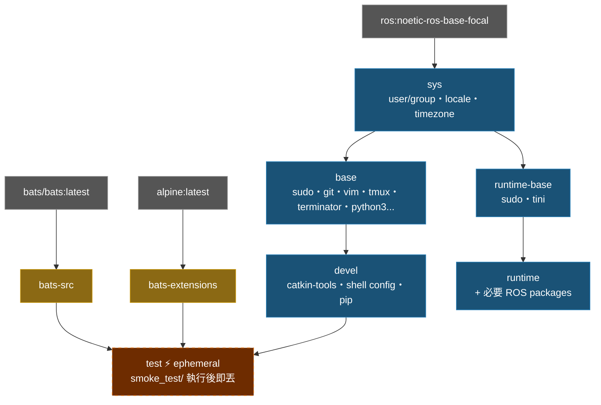

# ROS Noetic Docker Environment

ROS 1 Noetic 容器化開發環境，採用多階段建置，包含開發、測試、部署三種模式。

## 特色

- **多階段建置**：sys → base → devel / test / runtime，按需求選擇
- **Smoke Test**：build 時自動跑 Bats 測試驗證環境正確性
- **Docker Compose**：一個 `compose.yaml` 管理所有 target
- **自動偵測**：`setup.sh` 自動偵測 UID/GID/GPU/workspace，產生 `.env`
- **模組化設定**：shell config 透過 [docker_setup_helper](https://github.com/ycpss91255/docker_setup_helper) subtree 管理
- **GPU 支援**：自動偵測 NVIDIA Container Toolkit
- **X11 轉發**：支援 GUI 應用程式（RViz、Terminator 等）

## 快速開始

```bash
# 1. 產生 .env（自動偵測系統參數）
./setup.sh

# 2. 建置並啟動開發環境
docker compose up -d devel
docker compose exec devel bash

# 3. 停止
docker compose down
```

## 使用方式

### 開發環境（devel）

完整開發環境，含 catkin-tools、tmux、terminator、vim、git 等。

```bash
docker compose build devel       # 建置
docker compose run --rm devel    # 啟動（一次性）
docker compose up -d devel       # 背景啟動
docker compose exec devel bash   # 進入已啟動的容器
```

### 測試（test）

建置時自動執行 smoke test，失敗則 build 中斷。

```bash
docker compose build test
```

### 部署（runtime）

最小化映像，僅含必要 ROS packages。

```bash
docker compose --profile runtime build runtime
docker compose --profile runtime run --rm runtime
```

## 設定

### .env 參數

執行 `./setup.sh` 自動產生，或參考 `.env.example` 手動建立：

| 變數 | 說明 | 範例 |
|------|------|------|
| `USER_NAME` | 容器內用戶名 | `developer` |
| `USER_GROUP` | 用戶群組 | `developer` |
| `USER_UID` | 用戶 UID（與 host 一致） | `1000` |
| `USER_GID` | 用戶 GID（與 host 一致） | `1000` |
| `HARDWARE` | 硬體架構 | `x86_64` |
| `DOCKER_HUB_USER` | Docker Hub 用戶名 | `myuser` |
| `GPU_ENABLED` | GPU 支援 | `true` / `false` |
| `IMAGE_NAME` | 映像名稱 | `ros_noetic` |
| `WS_PATH` | 工作區掛載路徑 | `/home/user/catkin_ws` |
| `ROS_DISTRO` | ROS 發行版（可選） | `noetic` |
| `ROS_TAG` | ROS 映像標籤（可選） | `ros-base` |

## 架構

### Docker Build Stage 關係圖



### Stage 說明

| Stage | FROM | 用途 |
|-------|------|------|
| `bats-src` | `bats/bats:latest` | bats 二進位來源，不出貨 |
| `bats-extensions` | `alpine:latest` | bats-support、bats-assert，不出貨 |
| `sys` | `ros:noetic-ros-base-focal` | OS 基礎：user/group、locale、timezone |
| `base` | `sys` | 通用開發工具（apt） |
| `devel` | `base` | 完整開發環境，含 shell 設定 |
| `test` | `devel` | 注入 bats，執行 smoke_test/，build 完即丟 |
| `runtime-base` | `sys` | 最小化 runtime 基底，無 dev tools |
| `runtime` | `runtime-base` | 加入應用所需 ROS packages |

### Smoke Test 涵蓋範圍

位於 `smoke_test/ros_env.bats`：

- ROS 環境：`ROS_DISTRO`、`setup.bash` 可 source、`rostopic`/`rosrun` 存在
- Dev tools：`catkin`、`python3`、`git` 可用
- 系統：非 root 用戶、timezone、locale、work 目錄可寫

## 目錄結構

```text
ros_noetic/
├── compose.yaml                 # Docker Compose 定義
├── Dockerfile                   # 多階段建置
├── setup.sh                     # .env 產生器（wrapper）
├── entrypoint.sh                # 容器進入點
├── .env.example                 # 環境變數範本
├── smoke_test/                  # Bats 環境測試
│   ├── ros_env.bats
│   └── test_helper.bash
└── docker_setup_helper/         # git subtree (v1.0.0)
    └── src/
        ├── setup.sh             # 系統偵測 + .env 產生
        └── config/              # shell/pip/terminator/tmux 設定
```

## 更新 docker_setup_helper

```bash
git subtree pull --prefix=docker_setup_helper \
    https://github.com/ycpss91255/docker_setup_helper.git v1.x.x --squash
```
