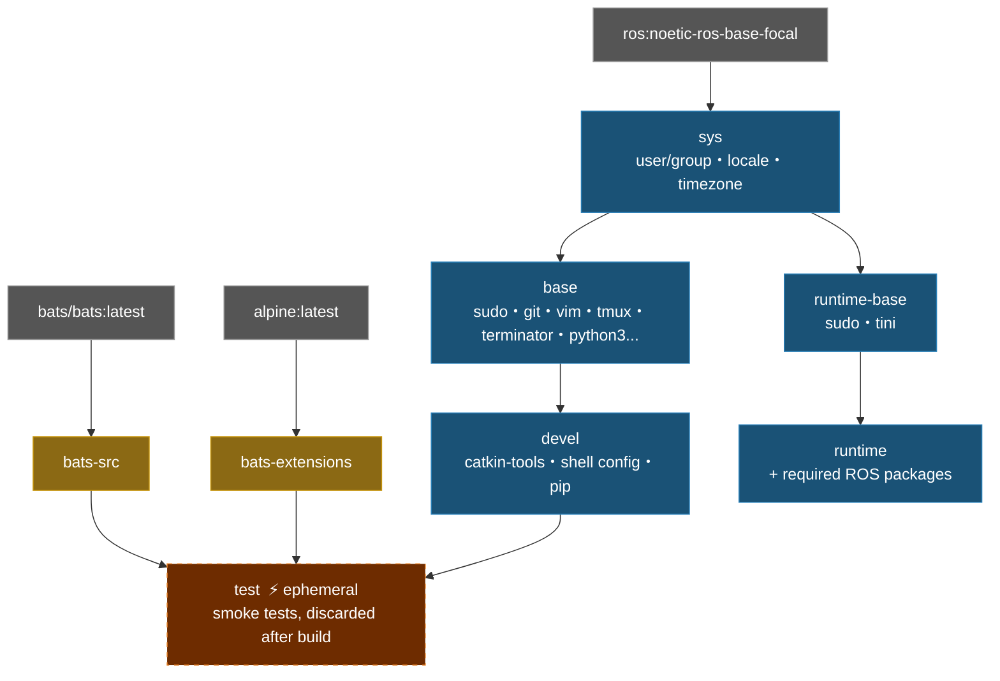

# ROS Noetic Docker Environment

**[English](README.md)** | **[繁體中文](doc/README.zh-TW.md)** | **[简体中文](doc/README.zh-CN.md)** | **[日本語](doc/README.ja.md)**

> **TL;DR** — One-command ROS 1 Noetic containerized dev environment. Auto-detects UID/GID, supports X11 GUI forwarding, multi-stage build with smoke test verification.
>
> ```bash
> ./build.sh && ./run.sh
> ```

---

## Table of Contents

- [Features](#features)
- [Quick Start](#quick-start)
- [Usage](#usage)
- [Configuration](#configuration)
- [Architecture](#architecture)
- [Smoke Tests](#smoke-tests)
- [Directory Structure](#directory-structure)
- [Updating docker\_setup\_helper](#updating-docker_setup_helper)

---

## Features

- **Multi-stage build**: sys → base → devel / test / runtime, choose as needed
- **Smoke Test**: Bats tests run automatically during build to verify environment
- **Docker Compose**: single `compose.yaml` manages all targets
- **Auto-detection**: `setup.sh` auto-detects UID/GID/workspace, generates `.env`
- **Modular config**: shell config managed via [docker_setup_helper](https://github.com/ycpss91255/docker_setup_helper) subtree
- **X11 forwarding**: supports GUI applications (RViz, Terminator, etc.)

## Quick Start

```bash
# 1. Build dev environment (auto-generates .env on first run)
./build.sh

# 2. Start container
./run.sh

# 3. Enter a running container
./exec.sh

# Or use docker compose directly
docker compose up -d devel
docker compose exec devel bash
docker compose down
```

## Usage

### Development (devel)

Full dev environment with catkin-tools, tmux, terminator, vim, git, etc.

```bash
./build.sh                       # Build (default: devel)
./build.sh --no-env test         # Build without refreshing .env
./run.sh                         # Start (default: devel)
./run.sh --no-env -d             # Background start, skip .env refresh
./exec.sh                        # Enter running container

docker compose build devel       # Equivalent command
docker compose run --rm devel    # One-off start
docker compose up -d devel       # Start in background
docker compose exec devel bash   # Enter running container
```

### Testing (test)

Smoke tests run automatically during build; build fails if tests fail.

```bash
./build.sh test
# or
docker compose --profile test build test
```

### Deployment (runtime)

Minimal image with only essential ROS packages.

```bash
./build.sh runtime
./run.sh runtime
# or
docker compose --profile runtime build runtime
docker compose --profile runtime run --rm runtime
```

## Configuration

### .env Parameters

Automatically refreshed on every `./build.sh` or `./run.sh` (use `--no-env` to skip). Refer to `.env.example` to create manually:

| Variable | Description | Example |
|----------|-------------|---------|
| `USER_NAME` | Container username | `developer` |
| `USER_GROUP` | User group | `developer` |
| `USER_UID` | User UID (matches host) | `1000` |
| `USER_GID` | User GID (matches host) | `1000` |
| `HARDWARE` | Hardware architecture | `x86_64` |
| `DOCKER_HUB_USER` | Docker Hub username | `myuser` |
| `GPU_ENABLED` | GPU support | `true` / `false` |
| `IMAGE_NAME` | Image name | `ros_noetic` |
| `WS_PATH` | Workspace mount path | `/home/user/catkin_ws` |
| `ROS_DISTRO` | ROS distribution (optional) | `noetic` |
| `ROS_TAG` | ROS image tag (optional) | `ros-base` |

### Auto-detection Details

`setup.sh` automatically detects system parameters and generates `.env`. The two most complex detections are documented below.

<details>
<summary>Click to expand detection logic</summary>

#### IMAGE_NAME Inference

Scans the repo directory path to derive the image name:

| Priority | Rule | Example Path | Result |
|:--------:|------|-------------|--------|
| 1 | Last directory matches `docker_*` → strip prefix | `/home/user/docker_ros_noetic` | `ros_noetic` |
| 2 | Scan path (right→left) for `*_ws` → use prefix | `/home/user/ros_noetic_ws/docker_ros_noetic` | `ros_noetic` |
| 3 | Read `IMAGE_NAME` from `.env.example` | — | value in `.env.example` |
| 4 | Fallback | — | `unknown` |

#### WS_PATH Workspace Detection

Three-strategy search to locate the workspace mount path:

| Priority | Strategy | Condition | Result |
|:--------:|----------|-----------|--------|
| 1 | Sibling scan | Current dir is `docker_*` and sibling `*_ws` exists | Sibling `*_ws` absolute path |
| 2 | Path traversal | Walk path upward, find first `*_ws` component | That `*_ws` directory |
| 3 | Fallback | None of the above | Parent directory of repo |

**Example** (strategy 1):
```
/home/user/
├── docker_ros_noetic/    ← repo (current dir = docker_ros_noetic)
└── ros_noetic_ws/        ← detected as WS_PATH
```

**Example** (strategy 2):
```
/home/user/ros_noetic_ws/src/docker_ros_noetic/
                         ↑ found *_ws while traversing upward
```

> If `.env` already exists and `WS_PATH` points to a valid directory, detection is skipped and the existing value is preserved.

</details>

### Language

`setup.sh` displays messages in English by default. Use `--lang zh` for Chinese when running `build.sh`:

```bash
# Re-generate .env with Chinese prompts
rm .env
SETUP_LANG=zh ./build.sh
```

## Architecture

### Docker Build Stage Diagram



### Stage Description

| Stage | FROM | Purpose |
|-------|------|---------|
| `bats-src` | `bats/bats:latest` | Bats binary source, not shipped |
| `bats-extensions` | `alpine:latest` | bats-support, bats-assert, not shipped |
| `sys` | `ros:noetic-ros-base-focal` | OS base: user/group, locale, timezone |
| `base` | `sys` | Common dev tools (apt) |
| `devel` | `base` | Full dev environment with shell config |
| `test` | `devel` | Injects bats, runs smoke_test/, discarded after build |
| `runtime-base` | `sys` | Minimal runtime base, no dev tools |
| `runtime` | `runtime-base` | Adds required ROS packages |

## Smoke Tests

Located in `smoke_test/ros_env.bats`, executed automatically during `docker build --target test` — **32 tests** total.

<details>
<summary>Click to expand test details</summary>

#### ROS environment (9)

| Test | Description |
|------|-------------|
| `ROS_DISTRO` | Value is `noetic` |
| `setup.bash` | File exists |
| `setup.bash` | Can be sourced |
| `rostopic` | Available after sourcing ROS |
| `rosrun` | Available after sourcing ROS |
| `rosnode` | Available after sourcing ROS |
| `roslaunch` | Available after sourcing ROS |
| `rosmsg` | Available after sourcing ROS |
| `catkin` | Available |

#### Base tools (11)

| Test | Description |
|------|-------------|
| `python3` | Available |
| `pip3` | Available |
| `git` | Available |
| `vim` | Available |
| `curl` | Available |
| `wget` | Available |
| `tmux` | Available |
| `tree` | Available |
| `htop` | Available |
| `sudo` | Available |
| `sudo` | Passwordless works |

#### System (12)

| Test | Description |
|------|-------------|
| User | Not root |
| `HOME` | Set and exists |
| Timezone | `Asia/Taipei` |
| `LANG` | `en_US.UTF-8` |
| `LC_ALL` | `en_US.UTF-8` |
| `NVIDIA_VISIBLE_DEVICES` | `all` |
| `NVIDIA_DRIVER_CAPABILITIES` | `all` |
| `entrypoint.sh` | Exists and executable |
| Work directory | Exists |
| Work directory | Writable |
| `bash-completion` | Installed |

</details>

## Directory Structure

```text
ros_noetic/
├── compose.yaml                 # Docker Compose definition
├── Dockerfile                   # Multi-stage build
├── build.sh                     # Build script (runs from any directory)
├── run.sh                       # Run script (runs from any directory)
├── exec.sh                      # Enter running container
├── entrypoint.sh                # Container entrypoint
├── .env.example                 # Environment variable template
├── .github/workflows/           # CI/CD
│   ├── main.yaml                # Main pipeline
│   ├── build-worker.yaml        # Docker build + smoke test
│   └── release-worker.yaml      # GitHub Release
├── smoke_test/                  # Bats environment tests
│   ├── ros_env.bats
│   └── test_helper.bash
└── docker_setup_helper/         # git subtree (v1.1.0)
    └── src/
        ├── setup.sh             # System detection + .env generation
        └── config/              # shell/pip/terminator/tmux config
```

## Updating docker_setup_helper

```bash
git subtree pull --prefix=docker_setup_helper \
    https://github.com/ycpss91255/docker_setup_helper.git v1.x.x --squash
```
