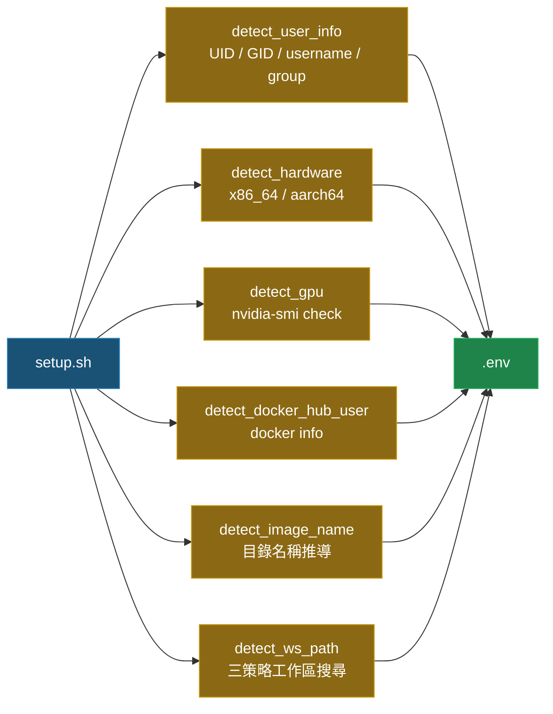
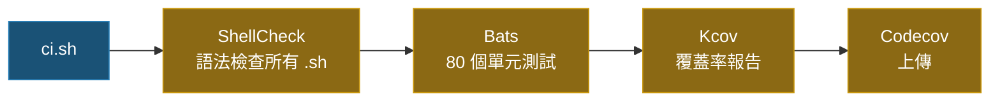

# Docker Setup Helper [](https://github.com/ycpss91255/docker_setup_helper/actions) [](https://codecov.io/gh/ycpss91255/docker_setup_helper)


[](./LICENSE)

[English](./README.md) | [繁體中文]

> **TL;DR** — 模組化 Bash 工具組，自動偵測系統參數（UID/GID、GPU、架構、工作區）並產生 `.env` 供 Docker Compose 建置使用。100% 測試覆蓋率（Bats + Kcov）。
>
> ```bash
> ./src/setup.sh        # 產生 .env
> ./ci.sh               # 在地執行測試
> ```

模組化的 Docker 環境設定工具組，自動偵測系統參數並產生 `.env` 檔案，供 Docker 容器建置使用。設計用來取代傳統的 `get_param.sh`，具備可測試、可擴展的架構。

## 🌟 特色

- **系統偵測**：自動偵測使用者資訊（UID/GID）、硬體架構、GPU 支援及 Docker Hub 帳號。
- **映像名稱推導**：從目錄結構推導映像名稱（相容 `docker_*` 前綴與 `*_ws` 後綴慣例）。
- **工作區搜尋**：三策略工作區路徑偵測（同層掃描、向上遍歷、退回上層目錄）。
- **`.env` 生成**：產出可直接用於 Docker Compose 建置的 `.env` 檔案。
- **Shell 設定管理**：內建 Bash、Tmux、Terminator 的設定腳本。
- **100% 測試覆蓋率**：所有原始碼皆以 Bats + Kcov 完整測試。

## 📁 專案結構

```text
.
├── src/
│   ├── setup.sh                         # 主程式（取代 get_param.sh）
│   └── config/
│       ├── pip/
│       │   ├── setup.sh                 # pip 套件安裝腳本
│       │   └── requirements.txt         # Python 相依套件
│       └── shell/
│           ├── bashrc                   # Bash 設定檔
│           ├── terminator/
│           │   ├── setup.sh             # Terminator 設定腳本
│           │   └── config               # Terminator 設定檔
│           └── tmux/
│               ├── setup.sh             # Tmux + TPM 設定腳本
│               └── tmux.conf            # Tmux 設定檔
├── test/                                # Bats 測試案例（80 個測試）
│   ├── test_helper.bash                 # 測試輔助工具與 mock 函式
│   ├── setup_spec.bats                  # setup.sh 測試（26 個案例）
│   ├── bashrc_spec.bats                 # bashrc 驗證測試（14 個案例）
│   ├── pip_setup_spec.bats              # pip 安裝測試（3 個案例）
│   ├── terminator_config_spec.bats      # terminator 設定驗證（10 個案例）
│   ├── terminator_setup_spec.bats       # terminator 安裝測試（7 個案例）
│   ├── tmux_conf_spec.bats             # tmux.conf 驗證測試（12 個案例）
│   └── tmux_setup_spec.bats             # tmux 安裝測試（8 個案例）
├── ci.sh                                # 在地 CI 啟動腳本
├── docker-compose.yaml                  # Docker CI 環境
├── .codecov.yaml                        # Codecov 設定檔
└── LICENSE
```

## 📦 依賴項

執行在地 CI 流程需要具備：
- **Docker**：用於執行測試環境。
- **Docker Compose**：用於管理容器服務。

CI 容器內部會自動處理以下工具：
- **Bats Core**：測試框架。
- **ShellCheck**：語法檢查工具。
- **Kcov**：覆蓋率報告產生器。
- **bats-mock**：命令模擬函式庫。

## 🚀 快速上手

### 1. 執行設定（產生 `.env`）
```bash
./src/setup.sh
```
自動偵測系統參數並產生 `.env` 檔案：
```env
USER_NAME=youruser
USER_GROUP=yourgroup
USER_UID=1000
USER_GID=1000
HARDWARE=x86_64
DOCKER_HUB_USER=yourhubuser
GPU_ENABLED=false
IMAGE_NAME=myproject
WS_PATH=/path/to/workspace
```

### 2. 在 Docker Compose 中使用
在 `docker-compose.yaml` 中引用產生的 `.env`：
```yaml
services:
  dev:
    build:
      args:
        USER_NAME: ${USER_NAME}
        USER_UID: ${USER_UID}
        USER_GID: ${USER_GID}
    volumes:
      - ${WS_PATH}:/home/${USER_NAME}/work
```

### 3. 透過 Git Subtree 整合
```bash
git subtree add --prefix=docker_setup_helper \
    https://github.com/ycpss91255/docker_setup_helper.git main --squash
```

### 4. 在地執行完整檢查（CI）
```bash
chmod +x ci.sh
./ci.sh
```
透過 Docker 執行 ShellCheck 語法檢查、Bats 單元測試及 Kcov 覆蓋率報告。

## 🛠 開發指南

### ShellCheck 規範
本專案嚴格執行 ShellCheck 檢查。若有動態載入需求，請使用標籤抑制警告：
```bash
# shellcheck disable=SC1090
source "${DYNAMIC_PATH}"
```

### 測試覆蓋率
我們追求高品質的程式碼，設定如下：
- **新程式碼（Patch）**：必須 100% 覆蓋。
- **整體專案（Project）**：只進步，不退步（`auto`）。

### BASH_SOURCE Guard 模式
所有腳本皆使用 `BASH_SOURCE` 守衛模式，確保可測試性：
```bash
if [[ "${BASH_SOURCE[0]:-}" == "${0:-}" ]]; then
    main "$@"
fi
```

## 架構

### 偵測與產生流程



### IMAGE_NAME 推導（`detect_image_name`）

掃描 repo 目錄路徑，推導 Docker 映像名稱：

| 優先序 | 規則 | 範例路徑 | 結果 |
|:------:|------|----------|------|
| 1 | 掃描完整路徑（**右→左**）找 `*_ws` 目錄 → 取 `_ws` 前面的名稱 | `/home/user/ros_noetic_ws/docker/ros_noetic` → 找到 `ros_noetic_ws` | `ros_noetic` |
| 2 | 最後一層目錄符合 `docker_*` → 去掉 `docker_` 前綴 | `/home/user/docker_ros_noetic` | `ros_noetic` |
| 3 | 讀取 repo 根目錄 `.env.example` 中的 `IMAGE_NAME=` | `.env.example` 含 `IMAGE_NAME=ros_noetic` | `ros_noetic` |
| 4 | 退回值 | 以上皆不符合 | `unknown` |

### WS_PATH 工作區偵測（`detect_ws_path`）

三策略搜尋，依序執行直到成功為止：

#### 策略 1 — 同層掃描

若**目前目錄名稱**以 `docker_` 開頭，去掉前綴後在**同層**尋找 `{name}_ws` 目錄。

```
/home/user/
├── docker_ros_noetic/    ← 目前目錄符合 docker_*
│   └── (此 repo)            去前綴 → "ros_noetic"
└── ros_noetic_ws/        ← 同層找到 ros_noetic_ws → WS_PATH
```

#### 策略 2 — 向上遍歷

沿著**絕對路徑逐層向上**檢查，若某層目錄名稱以 `_ws` 結尾，即使用該目錄。

```
/home/user/ros_noetic_ws/src/docker_ros_noetic/
           ^^^^^^^^^^^^^^
           向上遍歷：docker_ros_noetic → src → ros_noetic_ws（命中！）
           → WS_PATH = /home/user/ros_noetic_ws
```

#### 策略 3 — 退回上層目錄

若以上兩個策略都沒有找到 `_ws` 目錄，退回使用 repo 的**上一層目錄**。

```
/home/user/projects/ros_noetic/
                    ^^^^^^^^^^^  ← repo（路徑中無 *_ws）
           ^^^^^^^^              ← WS_PATH = /home/user/projects
```

> **注意：** 若 `.env` 已存在且 `WS_PATH` 指向有效目錄，則完全跳過偵測，保留現有值。

### CI 流程



## 📄 授權
[GPL-3.0](./LICENSE)
