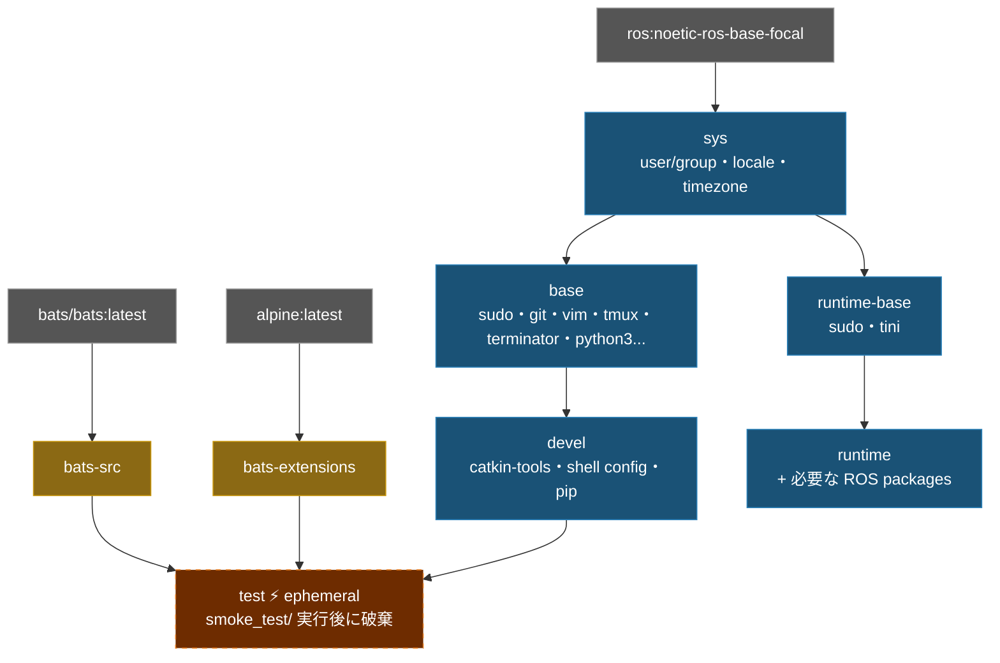

# ROS Noetic Docker Environment

**[English](../README.md)** | **[繁體中文](README.zh-TW.md)** | **[简体中文](README.zh-CN.md)** | **[日本語](README.ja.md)**

> **TL;DR** — ワンコマンドで ROS 1 Noetic コンテナ化開発環境をビルド。UID/GID を自動検出、X11 GUI 転送対応、マルチステージビルドで smoke test 検証付き。
>
> ```bash
> ./build.sh && ./run.sh
> ```

---

## 目次

- [特徴](#特徴)
- [クイックスタート](#クイックスタート)
- [使い方](#使い方)
- [Subtree としての利用](#subtree-としての利用)
- [設定](#設定)
- [アーキテクチャ](#アーキテクチャ)
- [スモークテスト](#スモークテスト)
- [ディレクトリ構成](#ディレクトリ構成)
- [docker\_setup\_helper の更新](#docker_setup_helper-の更新)

---

## 特徴

- **マルチステージビルド**：sys → base → devel / test / runtime、用途に応じて選択
- **Smoke Test**：ビルド時に Bats テストを自動実行し環境の正確性を検証
- **Docker Compose**：1 つの `compose.yaml` で全 target を管理
- **自動検出**：`setup.sh` が UID/GID/workspace を自動検出し `.env` を生成
- **モジュール化設定**：shell config は [docker_setup_helper](https://github.com/ycpss91255/docker_setup_helper) subtree で管理
- **X11 転送**：GUI アプリケーション対応（RViz、Terminator 等）

## クイックスタート

```bash
# 1. 開発環境をビルド（初回は自動で .env を生成）
./build.sh

# 2. コンテナを起動
./run.sh

# 3. 起動中のコンテナに接続
./exec.sh

# または docker compose を直接使用
docker compose up -d devel
docker compose exec devel bash
docker compose down
```

## 使い方

### 開発環境（devel）

フル機能の開発環境。catkin-tools、tmux、terminator、vim、git 等を含む。

```bash
./build.sh                       # ビルド（デフォルト devel）
./build.sh --no-env test         # ビルドするが .env は更新しない
./run.sh                         # 起動（デフォルト devel）
./run.sh --no-env -d             # バックグラウンド起動、.env 更新をスキップ
./exec.sh                        # 起動中のコンテナに接続

docker compose build devel       # 同等コマンド
docker compose run --rm devel    # ワンショット起動
docker compose up -d devel       # バックグラウンド起動
docker compose exec devel bash   # 起動中のコンテナに接続
```

### テスト（test）

ビルド時に smoke test を自動実行。失敗するとビルドが中断される。

```bash
./build.sh test
# または
docker compose --profile test build test
```

### デプロイ（runtime）

最小化イメージ。必要な ROS packages のみ含む。

```bash
./build.sh runtime
./run.sh runtime
# または
docker compose --profile runtime build runtime
docker compose --profile runtime run --rm runtime
```

## Subtree としての利用

このリポジトリは `git subtree` で他のプロジェクトに埋め込むことができ、プロジェクトに Docker 開発環境を同梱できます。

### プロジェクトへの追加

```bash
git subtree add --prefix=docker/ros_noetic \
    https://github.com/ycpss91255-docker/ros_noetic.git main --squash
```

追加後のディレクトリ構成例：

```text
my_robot_project/
├── src/                         # プロジェクトソースコード
├── docker/ros_noetic/           # Subtree
│   ├── build.sh
│   ├── run.sh
│   ├── compose.yaml
│   ├── Dockerfile
│   └── docker_setup_helper/
└── ...
```

### ビルドと実行

```bash
cd docker/ros_noetic
./build.sh && ./run.sh
```

`build.sh` は内部で `--base-path` を使用するため、どのディレクトリから実行してもパス検出が正しく動作します。

### ワークスペース検出の動作

<details>
<summary>クリックして subtree 使用時の検出動作を表示</summary>

subtree が `my_robot_project/docker/ros_noetic/` にある場合：

- **IMAGE_NAME**：ディレクトリ名は `ros_noetic`（`docker_*` ではない）ため、検出は `.env.example` の `IMAGE_NAME=ros_noetic` にフォールバック — 正常に動作。
- **WS_PATH**：戦略 1（同階層スキャン）と戦略 2（上方向走査）が一致しない場合、戦略 3（フォールバック）で親ディレクトリ（`my_robot_project/docker/`）に解決される。

**推奨**：初回ビルド後、`.env` の `WS_PATH` を実際のワークスペースに手動編集してください。以降のビルドではこの値が保持されます。

</details>

### 上流との同期

```bash
git subtree pull --prefix=docker/ros_noetic \
    https://github.com/ycpss91255-docker/ros_noetic.git main --squash
```

> **注意事項**：
> - ローカルの変更は git で通常通り追跡されます。
> - 上流があなたが変更したファイルも変更した場合、`subtree pull` で merge conflict が発生する可能性があり、手動で解決が必要です。
> - subtree 内の `docker_setup_helper/` は**直接変更しないでください** — env リポジトリ自身の subtree として管理されています。

## 設定

### .env パラメータ

`./build.sh` または `./run.sh` 実行時に自動更新（`--no-env` でスキップ）。または `.env.example` を参考に手動作成：

| 変数 | 説明 | 例 |
|------|------|------|
| `USER_NAME` | コンテナ内ユーザー名 | `developer` |
| `USER_GROUP` | ユーザーグループ | `developer` |
| `USER_UID` | ユーザー UID（host と一致） | `1000` |
| `USER_GID` | ユーザー GID（host と一致） | `1000` |
| `HARDWARE` | ハードウェアアーキテクチャ | `x86_64` |
| `DOCKER_HUB_USER` | Docker Hub ユーザー名 | `myuser` |
| `GPU_ENABLED` | GPU サポート | `true` / `false` |
| `IMAGE_NAME` | イメージ名 | `ros_noetic` |
| `WS_PATH` | ワークスペースマウントパス | `/home/user/catkin_ws` |
| `ROS_DISTRO` | ROS ディストリビューション（任意） | `noetic` |
| `ROS_TAG` | ROS イメージタグ（任意） | `ros-base` |

### 自動検出の詳細

`setup.sh` がシステムパラメータを自動検出し `.env` を生成する。以下は 2 つの複雑な検出ロジックの記録。

<details>
<summary>クリックして検出ロジックを表示</summary>

#### IMAGE_NAME の推論

repo ディレクトリパスをスキャンし、イメージ名を推論：

| 優先順 | ルール | パス例 | 結果 |
|:------:|--------|--------|------|
| 1 | 最後のディレクトリが `docker_*` に一致 → プレフィックスを除去 | `/home/user/docker_ros_noetic` | `ros_noetic` |
| 2 | パスをスキャン（右→左）して `*_ws` を探す → プレフィックスを取得 | `/home/user/ros_noetic_ws/docker_ros_noetic` | `ros_noetic` |
| 3 | `.env.example` の `IMAGE_NAME` を読み取り | — | `.env.example` の値 |
| 4 | フォールバック | — | `unknown` |

#### WS_PATH ワークスペース検出

3 つの戦略で検索し、ワークスペースマウントパスを特定：

| 優先順 | 戦略 | 条件 | 結果 |
|:------:|------|------|------|
| 1 | 同階層スキャン | 現在のディレクトリが `docker_*` で同階層に `*_ws` あり | 同階層の `*_ws` 絶対パス |
| 2 | 上方向へ走査 | パスを上方向にたどり最初の `*_ws` を探す | その `*_ws` ディレクトリ |
| 3 | フォールバック | 上記いずれにも該当しない | repo の親ディレクトリ |

**例**（戦略 1）：
```
/home/user/
├── docker_ros_noetic/    ← repo（現在のディレクトリ = docker_ros_noetic）
└── ros_noetic_ws/        ← WS_PATH として検出
```

**例**（戦略 2）：
```
/home/user/ros_noetic_ws/src/docker_ros_noetic/
                         ↑ 上方向へ走査時に *_ws を発見
```

> `.env` が既に存在し `WS_PATH` が有効なディレクトリを指している場合、検出をスキップし既存値を保持。

</details>

### 言語設定

`setup.sh` はデフォルトで英語メッセージを表示。環境変数で中国語に切り替え可能：

```bash
# .env を再生成（中国語プロンプト）
rm .env
SETUP_LANG=zh ./build.sh
```

## アーキテクチャ

### Docker Build Stage 関係図



### Stage 説明

| Stage | FROM | 用途 |
|-------|------|------|
| `bats-src` | `bats/bats:latest` | bats バイナリソース、出荷しない |
| `bats-extensions` | `alpine:latest` | bats-support、bats-assert、出荷しない |
| `sys` | `ros:noetic-ros-base-focal` | OS 基盤：user/group、locale、timezone |
| `base` | `sys` | 汎用開発ツール（apt） |
| `devel` | `base` | フル開発環境、shell 設定含む |
| `test` | `devel` | bats を注入、smoke_test/ を実行、ビルド後に破棄 |
| `runtime-base` | `sys` | 最小化 runtime ベース、dev tools なし |
| `runtime` | `runtime-base` | アプリに必要な ROS packages を追加 |

## スモークテスト

`test/smoke_test/` に配置、`docker build --target test` 時に自動実行、合計 **44** 項目。

<details>
<summary>クリックしてテスト詳細を表示</summary>

#### ROS 環境 (9)

| テスト項目 | 説明 |
|------------|------|
| `ROS_DISTRO` | 値が `noetic` |
| `setup.bash` | ファイルが存在 |
| `setup.bash` | source 可能 |
| `rostopic` | ROS を source 後に使用可能 |
| `rosrun` | ROS を source 後に使用可能 |
| `rosnode` | ROS を source 後に使用可能 |
| `roslaunch` | ROS を source 後に使用可能 |
| `rosmsg` | ROS を source 後に使用可能 |
| `catkin` | 使用可能 |

#### 基本ツール (11)

| テスト項目 | 説明 |
|------------|------|
| `python3` | 使用可能 |
| `pip3` | 使用可能 |
| `git` | 使用可能 |
| `vim` | 使用可能 |
| `curl` | 使用可能 |
| `wget` | 使用可能 |
| `tmux` | 使用可能 |
| `tree` | 使用可能 |
| `htop` | 使用可能 |
| `sudo` | 使用可能 |
| `sudo` | パスワードなしで実行 |

#### システム (12)

| テスト項目 | 説明 |
|------------|------|
| ユーザー | root ではない |
| `HOME` | 設定済みで存在 |
| タイムゾーン | `Asia/Taipei` |
| `LANG` | `en_US.UTF-8` |
| `LC_ALL` | `en_US.UTF-8` |
| `NVIDIA_VISIBLE_DEVICES` | `all` |
| `NVIDIA_DRIVER_CAPABILITIES` | `all` |
| `entrypoint.sh` | 存在し実行可能 |
| work ディレクトリ | 存在 |
| work ディレクトリ | 書き込み可能 |
| `bash-completion` | インストール済み |

#### スクリプト help (12)

| テスト項目 | 説明 |
|------------|------|
| `build.sh -h` | 終了コード 0 |
| `build.sh --help` | 終了コード 0 |
| `build.sh -h` | usage を表示 |
| `run.sh -h` | 終了コード 0 |
| `run.sh --help` | 終了コード 0 |
| `run.sh -h` | usage を表示 |
| `exec.sh -h` | 終了コード 0 |
| `exec.sh --help` | 終了コード 0 |
| `exec.sh -h` | usage を表示 |
| `stop.sh -h` | 終了コード 0 |
| `stop.sh --help` | 終了コード 0 |
| `stop.sh -h` | usage を表示 |

</details>

## ディレクトリ構成

```text
ros_noetic/
├── compose.yaml                 # Docker Compose 定義
├── Dockerfile                   # マルチステージビルド
├── build.sh                     # ビルドスクリプト（任意のディレクトリから実行可能）
├── run.sh                       # 起動スクリプト（任意のディレクトリから実行可能）
├── exec.sh                      # 起動中のコンテナに接続
├── stop.sh                      # コンテナの停止・削除
├── .env.example                 # 環境変数テンプレート
├── .hadolint.yaml               # Hadolint 無視ルール
├── script/
│   └── entrypoint.sh            # コンテナエントリポイント
├── doc/
│   ├── README.zh-TW.md          # 繁体字中国語
│   ├── README.zh-CN.md          # 簡体字中国語
│   └── README.ja.md             # 日本語
├── .github/workflows/           # CI/CD
│   ├── main.yaml                # メインパイプライン
│   ├── build-worker.yaml        # Docker build + smoke test
│   └── release-worker.yaml      # GitHub Release
├── test/
│   └── smoke_test/              # Bats 環境テスト
│       ├── ros_env.bats
│       ├── script_help.bats
│       └── test_helper.bash
└── docker_setup_helper/         # git subtree (v1.3.1)
    └── src/
        ├── setup.sh             # システム検出 + .env 生成
        └── config/              # shell/pip/terminator/tmux 設定
```

## docker_setup_helper の更新

```bash
git subtree pull --prefix=docker_setup_helper \
    https://github.com/ycpss91255-docker/docker_setup_helper.git v1.3.1 --squash
```
