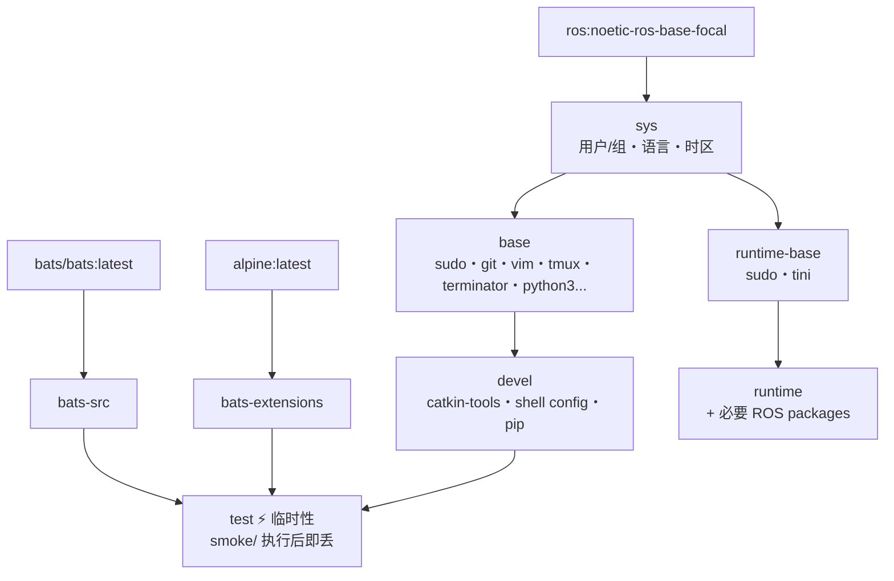

# ROS Noetic Docker Environment

**[English](../README.md)** | **[繁體中文](README.zh-TW.md)** | **[简体中文](README.zh-CN.md)** | **[日本語](README.ja.md)**

> **TL;DR** — 一键构建 ROS 1 Noetic 容器化开发环境。自动检测 UID/GID，支持 X11 GUI 转发，多阶段构建含 smoke test 验证。
>
> ```bash
> ./build.sh && ./run.sh
> ```

---

## 目录

- [特色](#特色)
- [快速开始](#快速开始)
- [使用方式](#使用方式)
- [作为 Subtree 使用](#作为-subtree-使用)
- [设置](#设置)
- [架构](#架构)
- [Smoke Tests](#smoke-tests)
- [目录结构](#目录结构)
- [更新 docker\_template](#更新-template)

---

## 特色

- **多阶段构建**：sys → base → devel / test / runtime，按需求选择
- **Smoke Test**：build 时自动跑 Bats 测试验证环境正确性
- **Docker Compose**：一个 `compose.yaml` 管理所有 target
- **自动检测**：`setup.sh` 自动检测 UID/GID/workspace，生成 `.env`
- **模块化设置**：shell config 通过 [template](https://github.com/ycpss91255-docker/template) subtree 管理
- **X11 转发**：支持 GUI 应用程序（RViz、Terminator 等）

## 快速开始

```bash
# 1. 构建开发环境（首次会自动生成 .env）
./build.sh

# 2. 启动容器
./run.sh

# 3. 进入已启动的容器
./exec.sh

# 或直接使用 docker compose
docker compose up -d devel
docker compose exec devel bash
docker compose down
```

## 使用方式

### 开发环境（devel）

完整开发环境，含 catkin-tools、tmux、terminator、vim、git 等。

```bash
./build.sh                       # 构建（默认 devel）
./build.sh --no-env test         # 构建但不更新 .env
./run.sh                         # 启动（默认 devel）
./run.sh --no-env -d             # 后台启动，跳过 .env 更新
./exec.sh                        # 进入已启动的容器

docker compose build devel       # 等效指令
docker compose run --rm devel    # 一次性启动
docker compose up -d devel       # 后台启动
docker compose exec devel bash   # 进入已启动的容器
```

### 测试（test）

构建时自动执行 smoke test，失败则 build 中断。

```bash
./build.sh test
# 或
docker compose --profile test build test
```

### 部署（runtime）

最小化镜像，仅含必要 ROS packages。

```bash
./build.sh runtime
./run.sh runtime
# 或
docker compose --profile runtime build runtime
docker compose --profile runtime run --rm runtime
```

## 作为 Subtree 使用

此 repo 可通过 `git subtree` 嵌入其他项目，让项目自带 Docker 开发环境。

### 添加到你的项目

```bash
git subtree add --prefix=docker/ros_noetic \
    https://github.com/ycpss91255-docker/ros_noetic.git main --squash
```

添加后的目录结构示例：

```text
my_robot_project/
├── src/                         # 项目源代码
├── docker/ros_noetic/           # Subtree
│   ├── build.sh
│   ├── run.sh
│   ├── compose.yaml
│   ├── Dockerfile
│   └── template/
└── ...
```

### 构建与运行

```bash
cd docker/ros_noetic
./build.sh && ./run.sh
```

`build.sh` 内部使用 `--base-path`，无论从哪里执行都能正确检测路径。

### 工作区检测行为

<details>
<summary>展开查看作为 subtree 时的检测行为</summary>

当 subtree 位于 `my_robot_project/docker/ros_noetic/` 时：

- **IMAGE_NAME**：目录名为 `ros_noetic`（非 `docker_*`），检测会回退到 `.env.example` 读取 `IMAGE_NAME=ros_noetic` — 正常工作。
- **WS_PATH**：策略 1（同层扫描）和策略 2（向上遍历）可能不匹配，策略 3（回退值）会解析到上层目录（`my_robot_project/docker/`）。

**建议**：首次 build 后，手动编辑 `.env` 中的 `WS_PATH` 指向实际工作区。后续 build 会保留此值。

</details>

### 同步上游更新

```bash
git subtree pull --prefix=docker/ros_noetic \
    https://github.com/ycpss91255-docker/ros_noetic.git main --squash
```

> **注意事项**：
> - 本地修改由 git 正常追踪。
> - 若上游改了你也修改过的文件，`subtree pull` 会产生 merge conflict，需手动解决。
> - **不要**直接修改 subtree 内的 `template/` — 那是 env repo 自己的 subtree。

## 设置

### .env 参数

每次执行 `./build.sh` 或 `./run.sh` 时自动更新（使用 `--no-env` 跳过）。或参考 `.env.example` 手动创建：

| 变量 | 说明 | 示例 |
|------|------|------|
| `USER_NAME` | 容器内用户名 | `developer` |
| `USER_GROUP` | 用户组 | `developer` |
| `USER_UID` | 用户 UID（与 host 一致） | `1000` |
| `USER_GID` | 用户 GID（与 host 一致） | `1000` |
| `HARDWARE` | 硬件架构 | `x86_64` |
| `DOCKER_HUB_USER` | Docker Hub 用户名 | `myuser` |
| `GPU_ENABLED` | GPU 支持 | `true` / `false` |
| `IMAGE_NAME` | 镜像名称 | `ros_noetic` |
| `WS_PATH` | 工作区挂载路径 | `/home/user/catkin_ws` |
| `ROS_DISTRO` | ROS 发行版（可选） | `noetic` |
| `ROS_TAG` | ROS 镜像标签（可选） | `ros-base` |

### 自动检测细节

`setup.sh` 自动检测系统参数并生成 `.env`。以下记录两个较复杂的检测逻辑。

<details>
<summary>展开查看检测逻辑</summary>

#### IMAGE_NAME 推导

扫描 repo 目录路径，推导镜像名称：

| 优先序 | 规则 | 示例路径 | 结果 |
|:------:|------|----------|------|
| 1 | 最后一层目录符合 `docker_*` → 去前缀 | `/home/user/docker_ros_noetic` | `ros_noetic` |
| 2 | 扫描路径（右→左）找 `*_ws` → 取前缀 | `/home/user/ros_noetic_ws/docker_ros_noetic` | `ros_noetic` |
| 3 | 读取 `.env.example` 中的 `IMAGE_NAME` | — | `.env.example` 中的值 |
| 4 | 回退值 | — | `unknown` |

#### WS_PATH 工作区检测

三策略搜索，定位工作区挂载路径：

| 优先序 | 策略 | 条件 | 结果 |
|:------:|------|------|------|
| 1 | 同层扫描 | 当前目录为 `docker_*` 且同层有 `*_ws` | 同层 `*_ws` 绝对路径 |
| 2 | 向上遍历 | 沿路径向上寻找第一个 `*_ws` 元件 | 该 `*_ws` 目录 |
| 3 | 回退值 | 以上皆不符合 | repo 的上层目录 |

**示例**（策略 1）：
```
/home/user/
├── docker_ros_noetic/    ← repo（当前目录 = docker_ros_noetic）
└── ros_noetic_ws/        ← 检测为 WS_PATH
```

**示例**（策略 2）：
```
/home/user/ros_noetic_ws/src/docker_ros_noetic/
                         ↑ 向上遍历时找到 *_ws
```

> 若 `.env` 已存在且 `WS_PATH` 指向有效目录，则跳过检测，保留现有值。

</details>

### 语言设置

`setup.sh` 默认显示英文消息，可通过环境变量切换为中文：

```bash
# 重新生成 .env（中文提示）
rm .env
SETUP_LANG=zh ./build.sh
```

## 架构

### Docker Build Stage 关系图



### Stage 说明

| Stage | FROM | 用途 |
|-------|------|------|
| `bats-src` | `bats/bats:latest` | bats 二进制来源，不出货 |
| `bats-extensions` | `alpine:latest` | bats-support、bats-assert，不出货 |
| `sys` | `ros:noetic-ros-base-focal` | OS 基础：用户/组、语言、时区 |
| `base` | `sys` | 通用开发工具（apt） |
| `devel` | `base` | 完整开发环境，含 shell 设置 |
| `test` | `devel` | 注入 bats，执行 smoke/，build 完即丢 |
| `runtime-base` | `sys` | 最小化 runtime 基底，无 dev tools |
| `runtime` | `runtime-base` | 加入应用所需 ROS packages |

## Smoke Tests

详见 [TEST.md](../test/TEST.md)。

## 目录结构

```text
ros_noetic/
├── compose.yaml                 # Docker Compose 定义
├── Dockerfile                   # 多阶段构建
├── build.sh                     # 构建脚本（任意目录可执行）
├── run.sh                       # 启动脚本（任意目录可执行）
├── exec.sh                      # 进入已启动的容器
├── stop.sh                      # 停止并移除容器
├── .env.example                 # 环境变量模板
├── .hadolint.yaml               # Hadolint 忽略规则
├── script/
│   └── entrypoint.sh            # 容器入口点
├── doc/
│   ├── README.zh-TW.md          # 繁体中文
│   ├── README.zh-CN.md          # 简体中文
│   └── README.ja.md             # 日文
├── .github/workflows/           # CI/CD
│   └── main.yaml                # CI/CD (template reusable workflows)
├── test/
│   └── smoke/              # Bats 环境测试
│       └── ros_env.bats         # Repo-specific
├── template/             # git subtree (v0.3.0)
│   ├── build.sh, run.sh, ...    # Shared scripts
│   ├── setup.sh                 # .env generation
│   ├── smoke/              # Shared smoke tests
│   └── config/                  # shell/pip/terminator/tmux
└── .template_version
```

## 更新 template

```bash
# Or use: ./template/scripts/upgrade.sh
git subtree pull --prefix=template \
    https://github.com/ycpss91255-docker/template.git v0.3.0 --squash
```
