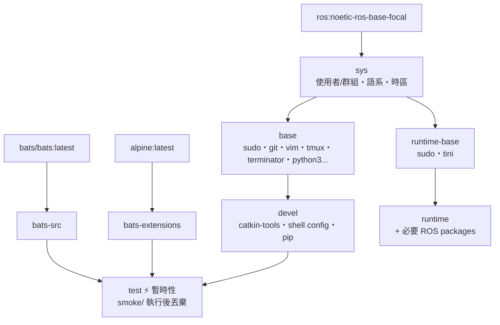

# ROS Noetic Docker Environment

**[English](../README.md)** | **[繁體中文](README.zh-TW.md)** | **[简体中文](README.zh-CN.md)** | **[日本語](README.ja.md)**

> **TL;DR** — 一鍵建置 ROS 1 Noetic 容器化開發環境。自動偵測 UID/GID，支援 X11 GUI 轉發，多階段建置含 smoke test 驗證。
>
> ```bash
> ./build.sh && ./run.sh
> ```

---

## 目錄

- [特色](#特色)
- [快速開始](#快速開始)
- [使用方式](#使用方式)
- [作為 Subtree 使用](#作為-subtree-使用)
- [設定](#設定)
- [架構](#架構)
- [Smoke Tests](#smoke-tests)
- [目錄結構](#目錄結構)
- [更新 docker\_template](#更新-template)

---

## 特色

- **多階段建置**：sys → base → devel / test / runtime，按需求選擇
- **Smoke Test**：build 時自動跑 Bats 測試驗證環境正確性
- **Docker Compose**：一個 `compose.yaml` 管理所有 target
- **自動偵測**：`setup.sh` 自動偵測 UID/GID/workspace，產生 `.env`
- **模組化設定**：shell config 透過 [template](https://github.com/ycpss91255-docker/template) subtree 管理
- **X11 轉發**：支援 GUI 應用程式（RViz、Terminator 等）

## 快速開始

```bash
# 1. 建置開發環境（首次會自動產生 .env）
./build.sh

# 2. 啟動容器
./run.sh

# 3. 進入已啟動的容器
./exec.sh

# 或直接使用 docker compose
docker compose up -d devel
docker compose exec devel bash
docker compose down
```

## 使用方式

### 開發環境（devel）

完整開發環境，含 catkin-tools、tmux、terminator、vim、git 等。

```bash
./build.sh                       # 建置（預設 devel）
./build.sh --no-env test         # 建置但不更新 .env
./run.sh                         # 啟動（預設 devel）
./run.sh --no-env -d             # 背景啟動，跳過 .env 更新
./exec.sh                        # 進入已啟動的容器

docker compose build devel       # 等效指令
docker compose run --rm devel    # 一次性啟動
docker compose up -d devel       # 背景啟動
docker compose exec devel bash   # 進入已啟動的容器
```

### 測試（test）

建置時自動執行 smoke test，失敗則 build 中斷。

```bash
./build.sh test
# 或
docker compose --profile test build test
```

### 部署（runtime）

最小化映像，僅含必要 ROS packages。

```bash
./build.sh runtime
./run.sh -t runtime
# 或
docker compose --profile runtime build runtime
docker compose --profile runtime run --rm runtime
```

## 作為 Subtree 使用

此 repo 可透過 `git subtree` 嵌入其他專案，讓專案自帶 Docker 開發環境。

### 加入你的專案

```bash
git subtree add --prefix=docker/ros_noetic \
    https://github.com/ycpss91255-docker/ros_noetic.git main --squash
```

加入後的目錄結構範例：

```text
my_robot_project/
├── src/                         # 專案原始碼
├── docker/ros_noetic/           # Subtree
│   ├── build.sh
│   ├── run.sh
│   ├── compose.yaml
│   ├── Dockerfile
│   └── template/
└── ...
```

### 建置與執行

```bash
cd docker/ros_noetic
./build.sh && ./run.sh
```

`build.sh` 內部使用 `--base-path`，無論從哪裡執行都能正確偵測路徑。

### 工作區偵測行為

<details>
<summary>展開查看作為 subtree 時的偵測行為</summary>

當 subtree 位於 `my_robot_project/docker/ros_noetic/` 時：

- **IMAGE_NAME**：目錄名為 `ros_noetic`（非 `docker_*`），偵測會退回到 `.env.example` 讀取 `IMAGE_NAME=ros_noetic` — 正常運作。
- **WS_PATH**：策略 1（同層掃描）和策略 2（向上遍歷）可能不匹配，策略 3（退回值）會解析到上層目錄（`my_robot_project/docker/`）。

**建議**：首次 build 後，手動編輯 `.env` 中的 `WS_PATH` 指向實際工作區。後續 build 會保留此值。

</details>

### 同步上游更新

```bash
git subtree pull --prefix=docker/ros_noetic \
    https://github.com/ycpss91255-docker/ros_noetic.git main --squash
```

> **注意事項**：
> - 本地微調由 git 正常追蹤。
> - 若上游改了你也修改過的檔案，`subtree pull` 會產生 merge conflict，需手動解決。
> - **不要**直接修改 subtree 內的 `template/` — 那是 env repo 自己的 subtree。

## 設定

### .env 參數

每次執行 `./build.sh` 或 `./run.sh` 時自動更新（使用 `--no-env` 跳過）。或參考 `.env.example` 手動建立：

| 變數 | 說明 | 範例 |
|------|------|------|
| `USER_NAME` | 容器內用戶名 | `developer` |
| `USER_GROUP` | 用戶群組 | `developer` |
| `USER_UID` | 用戶 UID（與 host 一致） | `1000` |
| `USER_GID` | 用戶 GID（與 host 一致） | `1000` |
| `HARDWARE` | 硬體架構 | `x86_64` |
| `DOCKER_HUB_USER` | Docker Hub 用戶名 | `myuser` |
| `GPU_ENABLED` | GPU 支援 | `true` / `false` |
| `IMAGE_NAME` | 映像名稱 | `ros_noetic` |
| `WS_PATH` | 工作區掛載路徑 | `/home/user/catkin_ws` |
| `ROS_DISTRO` | ROS 發行版（可選） | `noetic` |
| `ROS_TAG` | ROS 映像標籤（可選） | `ros-base` |

### 自動偵測細節

`setup.sh` 自動偵測系統參數並產生 `.env`。以下記錄兩個較複雜的偵測邏輯。

<details>
<summary>展開查看偵測邏輯</summary>

#### IMAGE_NAME 推導

掃描 repo 目錄路徑，推導映像名稱：

| 優先序 | 規則 | 範例路徑 | 結果 |
|:------:|------|----------|------|
| 1 | 最後一層目錄符合 `docker_*` → 去前綴 | `/home/user/docker_ros_noetic` | `ros_noetic` |
| 2 | 掃描路徑（右→左）找 `*_ws` → 取前綴 | `/home/user/ros_noetic_ws/docker_ros_noetic` | `ros_noetic` |
| 3 | 讀取 `.env.example` 中的 `IMAGE_NAME` | — | `.env.example` 中的值 |
| 4 | 退回值 | — | `unknown` |

#### WS_PATH 工作區偵測

三策略搜尋，定位工作區掛載路徑：

| 優先序 | 策略 | 條件 | 結果 |
|:------:|------|------|------|
| 1 | 同層掃描 | 目前目錄為 `docker_*` 且同層有 `*_ws` | 同層 `*_ws` 絕對路徑 |
| 2 | 向上遍歷 | 沿路徑向上尋找第一個 `*_ws` 元件 | 該 `*_ws` 目錄 |
| 3 | 退回值 | 以上皆不符合 | repo 的上層目錄 |

**範例**（策略 1）：
```
/home/user/
├── docker_ros_noetic/    ← repo（目前目錄 = docker_ros_noetic）
└── ros_noetic_ws/        ← 偵測為 WS_PATH
```

**範例**（策略 2）：
```
/home/user/ros_noetic_ws/src/docker_ros_noetic/
                         ↑ 向上遍歷時找到 *_ws
```

> 若 `.env` 已存在且 `WS_PATH` 指向有效目錄，則跳過偵測，保留現有值。

</details>

### 語言設定

`setup.sh` 預設顯示英文訊息，可透過環境變數切換為中文：

```bash
# 重新產生 .env（中文提示）
rm .env
SETUP_LANG=zh ./build.sh
```

## 架構

### Docker Build Stage 關係圖



### Stage 說明

| Stage | FROM | 用途 |
|-------|------|------|
| `bats-src` | `bats/bats:latest` | bats 二進位來源，不出貨 |
| `bats-extensions` | `alpine:latest` | bats-support、bats-assert，不出貨 |
| `sys` | `ros:noetic-ros-base-focal` | OS 基礎：使用者/群組、語系、時區 |
| `base` | `sys` | 通用開發工具（apt） |
| `devel` | `base` | 完整開發環境，含 shell 設定 |
| `test` | `devel` | 注入 bats，執行 smoke/，build 完即丟 |
| `runtime-base` | `sys` | 最小化 runtime 基底，無 dev tools |
| `runtime` | `runtime-base` | 加入應用所需 ROS packages |

## Smoke Tests

詳見 [TEST.md](../test/TEST.md)。

## 目錄結構

```text
ros_noetic/
├── Dockerfile                   # 多階段建置
├── setup.conf                   # setup.sh 的 repo 層覆寫設定
├── build.sh                     # → template/script/docker/build.sh
├── run.sh                       # → template/script/docker/run.sh
├── exec.sh                      # → template/script/docker/exec.sh
├── stop.sh                      # → template/script/docker/stop.sh
├── setup.sh                     # → template/script/docker/setup.sh
├── setup_tui.sh                 # → template/script/docker/setup_tui.sh
├── Makefile                     # → template/script/docker/Makefile
├── .hadolint.yaml               # → template/.hadolint.yaml
├── .env.example                 # IMAGE_NAME fallback
├── config/                      # shell/pip/terminator/tmux 設定（從 template 複製）
├── script/
│   └── entrypoint.sh            # 容器進入點
├── doc/
│   ├── README.zh-TW.md          # 繁體中文
│   ├── README.zh-CN.md          # 簡體中文
│   ├── README.ja.md             # 日文
│   ├── test/TEST.md             # Smoke test 文件
│   └── changelog/CHANGELOG.md   # 變更記錄
├── .github/workflows/
│   └── main.yaml                # CI/CD（呼叫 template reusable workflows）
├── test/
│   └── smoke/
│       └── ros_env.bats         # Repo 專屬測試
└── template/                    # git subtree（版本記錄於 template/.version）
```

> `compose.yaml` 與 `.env` 為 `setup.sh` 依 `setup.conf` + 系統偵測產生的衍生檔案，
> 兩者皆已加入 `.gitignore`。

## 更新 template

```bash
./template/upgrade.sh             # 升級到最新 tag
./template/upgrade.sh v0.10.2     # 指定版本
./template/upgrade.sh --check     # 檢查是否有可升級版本
```

腳本會一次處理 `git subtree pull`、完整性檢查、`init.sh` symlink 重整，
以及 `main.yaml` 的 `@vX.Y.Z` workflow 引用更新。
